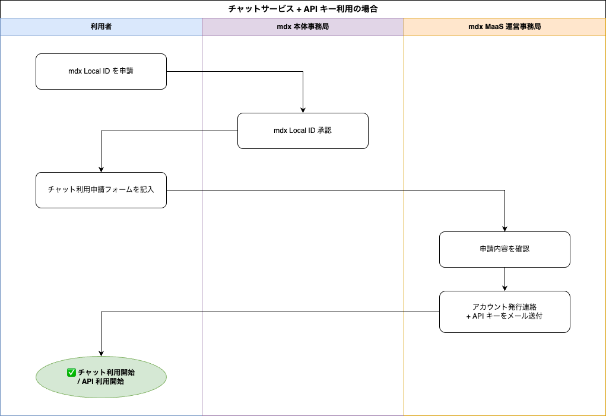

このページは、**mdx MaaS の チャットサービス（GUI）**を利用したい方向けの案内です。 Web ブラウザーから対話的に生成AIモデルを利用できるチャット UI を提供しています。
プログラミング環境がなくても、ブラウザーだけで手軽にモデルを試せます。
プログラムから呼び出したい / バッチ処理をしたい方には **API エンドポイント** のご利用を推奨します。
API の利用案内・申請手順は [mdx MaaS ユーザーポータル](portal.md) をご覧ください。

---

## ⚠️ 利用の前提：mdx Local ID の取得が必要です {#mdx-local-id}

チャットサービスの利用には、mdx MaaS の利用申請とは別に **mdx Local ID** の取得（mdx 本体事務局による承認）が必要です。**API のみの利用では mdx Local ID は不要** ですが、チャットサービスを利用する場合は必須です。

1. まず [mdx Local ID 申請ページ](https://mdx.jp/mdx1/form_page/local-id_application) から mdx Local ID を申請してください。
2. mdx 本体事務局による承認後、下記の「チャットサービス利用申請フォーム」へお進みください。

---

## β版テストユーザー登録 {#beta}

mdx MaaS の β 版のテストユーザーを募集します。テスト期間は **無料** です。

β 版利用にあたっての免責事項・Slack サポート・利用規約などの共通事項は [mdx MaaS ユーザーポータル の「β版テストユーザー登録」](portal.md#beta)をご覧ください。

### 利用開始までの流れ {#getting-started}

### 申請フォーム {#application-form}

mdx Local ID の取得（承認）後に、以下のフォームへお進みください。

- [チャットサービス利用申請フォーム](https://docs.google.com/forms/d/e/1FAIpQLSeYD9wDzhaMgTsshhl4e5B8mVEDzpPmHq3b73Bbnv3WkYRsnA/viewform)

> ⚠️ mdx Local ID を取得していない状態でフォームを記入されても、チャットサービスのアカウントは発行できません。先に [mdx Local ID 申請ページ](https://mdx.jp/mdx1/form_page/local-id_application) から申請してください。

---

## チャットサービス {#chat-service}

- ログイン URL: <https://local.maas.mdx1.jp>

ファイル添付にも対応していますが、以下の制約があります。

- ファイル形式（拡張子）は `pdf`, `txt`, `md`, `json`, `csv` に限ります（音声、画像ファイル等は未対応です）。
- モデルのコンテキスト長を超えるファイルを添付すると、プロンプトの応答が返ってこないことがあります。サイズの大きいファイルを使用する場合は、長いコンテキスト長をサポートするモデルをご利用ください。

---

## 現在利用可能なモデル {#models}

利用可能なモデルは以下のリストを参照してください。

- [利用可能モデル一覧（Google スプレッドシート）](https://docs.google.com/spreadsheets/d/18eMqI3kPDjVVBLRdyHSuinkJ-6ZVQ-Uh-8BWXHNBO0g/edit?gid=0#gid=0)

---

## FAQ {#faq}

Q. チャットサービス使用中に、操作（プロンプト送信を含む）が応答しなくなりました。

一時的にアクセスが集中している可能性がありますので、数分お待ちいただき、ページを強制読み込み（`Ctrl/Cmd + Shift + R`）してください。それでも改善しない場合は、下の問い合わせ先にご連絡ください。

Q. チャットサービスで、ファイルを添付してプロンプトを送っても応答が出ません。

モデルがサポートするコンテキスト長以上のサイズの大きいファイルを添付すると、モデル推論ができません。長いコンテキスト長をサポートするモデルをお試しください。

Q. API も併せて利用したいのですが？

チャットサービス利用申請フォームから申請いただいた方には、API キーも併せて発行します。API の利用方法は [mdx MaaS ユーザーポータル](portal.md) をご覧ください。

---

## 問い合わせ先 {#contact}

お問い合わせ先（アカウント発行済みの方の招待制 Slack / 未発行の方のメール窓口）・アカウント削除については、[mdx MaaS ユーザーポータル の「問い合わせ先」](portal.md#contact)をご覧ください。
