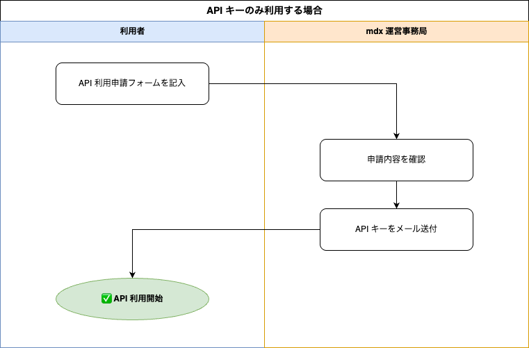

## mdx-MaaSについて {#about}

研究や教育の場における生成AIモデルの活用ニーズが高まっています。一方で、学術機関において実際に運用するには、一般の商用サービスを利用するには入力データやプロンプトについてのリスクがあり、オープンソースモデルを利用するにはそれを動作させる計算資源の確保が難しく、いずれもハードルが高いのが現状です。

そこで、学術機関が生成AIモデルを安全かつ効率的に活用するための推論基盤として **mdx-MaaS (Model as a Service)** を構築しました。mdx-MaaS では、研究・開発で柔軟に活用できる **API エンドポイント** を主軸に提供しています。加えて、GUI が必要な用途向けに **チャットサービス** も利用可能です。

詳細は、以下の [AXIES2025 発表資料（論文・スライド）](https://axies.secretari.jp/conf2025/) と [データ活用社会創成シンポジウム2025 発表動画](https://sites.google.com/g.ecc.u-tokyo.ac.jp/dp-sympo2025/) をご覧ください。

- [論文](https://drive.google.com/file/d/151shJavtk3e-55UC1fzvgb-XB2l-Db_T/view)
- [スライド](https://drive.google.com/file/d/1cWIeq-XuBai13iGTUC8tzGnkfuxjaYOE/view)
- [動画](https://www.dropbox.com/scl/fi/7dy12dgkwmbnpf69g6xeu/8-2_.mp4?rlkey=876ra71w0m744b62pi7f22qxh&e=2&st=jm78xq7s&dl=0)

> ※ [mdx](https://mdx.jp/mdx1/) は、データ活用社会創成プラットフォーム協働事業体の構成機関が運用し、研究環境を用途に合わせてオンデマンドで短時間に構築・拡張・融合できる、データ収集・集積・解析のためのプラットフォームを提供しています。

---

## API エンドポイントの主な用途 {#use-cases}

mdx-MaaS の API エンドポイントは、次のような用途に適しています。

- プログラムから呼び出したい
- バッチ処理で大量にリクエストを処理したい
- 自前で UI を構築したい

---

## β版テストユーザー登録 {#beta}

mdx-MaaS の β 版のテストユーザーを募集します。

サービスの本提供開始に向けて実環境での機能の検証と改善を目的としたもので、数回に分けて実施します。テスト期間は **無料** です。

### ⚠️ β版利用にあたっての免責事項 {#disclaimer}

本サービスは β 版であり、以下の点を予めご了承のうえご利用ください。

- 同時利用者が多い時間帯は **応答が遅くなる / 一時的に利用できない** ことがあります。
- サービスが予告なく停止・再起動される場合があります。
- 毎日深夜と早朝はメンテナンスのためサービスを停止します。
- β版期間中に発生したいかなる損害についても、運営事務局は責任を負いかねます。

### 申請から利用開始まで {#application-process}

ご希望の方は、下記の申請フォームに記入してください。事務局にて確認の上、ご利用いただける方にはサービスのリリース以降に個別にご連絡します。
なお、申請内容の確認およびアカウント発行には、通常 1 週間〜10 日程度のお時間をいただきます。
アカウント発行時に事務局より API キーをメールでお送りします。
アカウント発行については、サーバーの負荷状況などを鑑みながら **先着順** に随時対応していきますが、もし応募者数が想定発行数の上限を超えた場合、空きが出るまで利用開始をお待ちいただくこともあります。また、できる限り多くの方に β 版テストにご参加いただき実運用での課題を集めるため、**長期間利用されていないアカウントは停止することもあります**。

### 申請フォーム {#application-form}

- [API エンドポイント利用申請フォーム](https://docs.google.com/forms/d/e/1FAIpQLScDqbndNBzXhvyCXLAfqwDvwuAu4z_cnbZ6vo6xxzJz7cwm2A/viewform?usp=dialog)

### 💬 登録後のサポート {#support}

mdx-MaaS では、運営事務局および他のテストユーザーと連絡が取れる **Slack ワークスペース** を運用しています。

参加をご希望の方は、利用申請フォームの「ユーザーコミュニティへの参加希望」で「希望します」を選択してください（申請時に選択いただくのがおすすめです）。すでに申請済みで選択されなかった方は、[問い合わせ先](#contact)までお問い合わせください。

すべてのユーザーは mdx-MaaS の [利用規約](https://drive.google.com/file/d/1nFq-YFyaMmRWmitiDdWiibsoq26RXfNK/view) 及び [個人情報保護方針](https://drive.google.com/file/d/1oYNcZLQ5Kx3ZS2WX4Vb-4KJxLqrY-k-B/view?usp=drive_link) に加え、mdx の [利用規約](https://mdx.jp/wp-content/uploads/2023/04/jp_teams-of-service_20230323.pdf) 及び [個人情報保護方針](https://mdx.jp/wp-content/uploads/2022/12/privacy-policy_20221128.pdf) に同意したものと見なします。

### 利用開始までの流れ {#getting-started}

---

## API エンドポイント {#api-endpoints}

モデルを API から利用するためのエンドポイントを提供します。提供する API には以下の 2 種類があり、それぞれ対応しているモデルが異なります。

※ API のベース URL や認証方法（API キーの指定方法）は、下記の各ドキュメント内に記載しています。

### 即時応答 API {#chat-completions-api}

リクエストを送信すると、モデルの推論結果をリアルタイムで返します。**対話的な用途やリアルタイム処理**に適しています。
なお、一部のモデルはリクエストに応じてインスタンスを起動するオートスケーリング構成のため、リクエスト送信から応答受信までに **5〜10 分程度** かかる場合があります。インスタンス起動後は通常の応答速度でご利用いただけます。

- 公式ドキュメント (GitHub)

  <https://github.com/mdx-jp/mdx-maas-docs/blob/main/chat_completions_api_document.md>

- 使い方の解説記事 (Zenn)

  [mdx MaaSのAPIでLLM-jp-4を使う 第0回：準備](https://zenn.dev/suzumura_lab/articles/d56a1805bd7efd)

  [mdx MaaSのAPIでLLM-jp-4を使う 第1回：APIの呼び出しと回答の取り出し](https://zenn.dev/suzumura_lab/articles/50b62687aa9205)

### Batch API {#batch-api}

複数のリクエストをまとめてファイルとして投入し、バックグラウンドで非同期処理します。大量テキストの分類・翻訳・要約など、まとめて処理したい用途に適しています。処理完了後に結果ファイルを取得する形で利用します。

- 公式ドキュメント (GitHub)

  <https://github.com/mdx-jp/mdx-maas-docs/blob/main/batch_inference_api_document.md>

> 環境設定やプログラムの作成など必要な作業はすべてユーザー自身が行うものとし、個別のサポートは行いません。また、公平な利用のため、利用状況により 1 ユーザーあたりのトークン数やコール回数に一定のルールを設ける可能性があります。

---

## 現在利用可能なモデル {#models}

利用可能なモデルは以下のリストを参照してください。

- [利用可能モデル一覧（Google スプレッドシート）](https://docs.google.com/spreadsheets/d/18eMqI3kPDjVVBLRdyHSuinkJ-6ZVQ-Uh-8BWXHNBO0g/edit?gid=0#gid=0)

### 利用したいモデルのリクエストについて {#model-requests}

ご利用いただけるモデルは **随時追加していく予定** です。 リストに含まれていないモデルで利用したいものがある場合は、Slack（アカウント発行済みの方）または事務局メールアドレスまでご連絡ください。利用状況・計算資源を踏まえて追加可否を検討いたします。

---

## FAQ {#faq}

Q. どのようにユーザー登録を申請したらよいですか？

現在、β 版テストユーザーを募集しています。[β 版テストユーザー登録](#beta) を参照してください。

すべてのユーザーは mdx-MaaS の [利用規約](https://drive.google.com/file/d/1nFq-YFyaMmRWmitiDdWiibsoq26RXfNK/view) 及び [個人情報保護方針](https://drive.google.com/file/d/1oYNcZLQ5Kx3ZS2WX4Vb-4KJxLqrY-k-B/view?usp=drive_link) に加え、mdx の [利用規約](https://mdx.jp/wp-content/uploads/2023/04/jp_teams-of-service_20230323.pdf) 及び [個人情報保護方針](https://mdx.jp/wp-content/uploads/2022/12/privacy-policy_20221128.pdf) に同意したものと見なします。

Q. いつから利用できますか？

サービスの本提供開始の時期は未定です。

Q. 利用料金はいくらですか？

β 版テストユーザーは **無料** です。

サービスの本提供開始後はニーズに合わせた料金体系を検討する予定です。

Q. チャットサービス（GUI）を利用したいのですが？

ブラウザー上で対話的に使えるチャットサービスもご用意しています。利用方法・申請手順は以下のチャットサービス利用案内をご覧ください。

[チャットサービス利用案内](chat.md)

- **API のみご利用の方**：チャットサービスの利用は必須ではありません。プログラムから使う場合は、本ページの手順だけで利用を開始できます。

Q. API エンドポイントを利用できません。

- API キーの値が正しいか確認してください。
- 利用しているネットワークのファイヤーウォールとアンチウイルスソフトの設定で、API エンドポイントへの通信を許可しているか確認してください。
- 利用しているネットワークを管理する IT 担当部門にご相談ください。

Q. プロンプトはモデルの学習に使用されますか？

使用しません。

---

## 問い合わせ先 {#contact}

FAQ 以外の内容については mdx-MaaS 事務局までお問い合わせください。

### アカウント発行済みの方

**Slack** からお問い合わせください。

### アカウント未発行の方 / Slack に未参加の方

以下のメールアドレスまでご連絡ください。

- メール: [mdx-maas-support@mail.mdx.jp](mailto:mdx-maas-support@mail.mdx.jp)

なお、mdx-MaaS 以外に関するお問い合わせには一切対応しません。

※ mdx 本体の事務局では mdx-MaaS に関するお問い合わせには対応できませんので、必ず上記の連絡先にご連絡ください。

### アカウント削除 {#account-deletion}

アカウントの削除をご希望の方は、以下のフォームに記入をお願いいたします。

[アカウント削除申請フォーム](https://docs.google.com/forms/d/e/1FAIpQLSfrO7QXelXHtDJQiqHGImtcww2PkU31Y2l0-n3709DLeUPIGA/viewform?usp=dialog)
